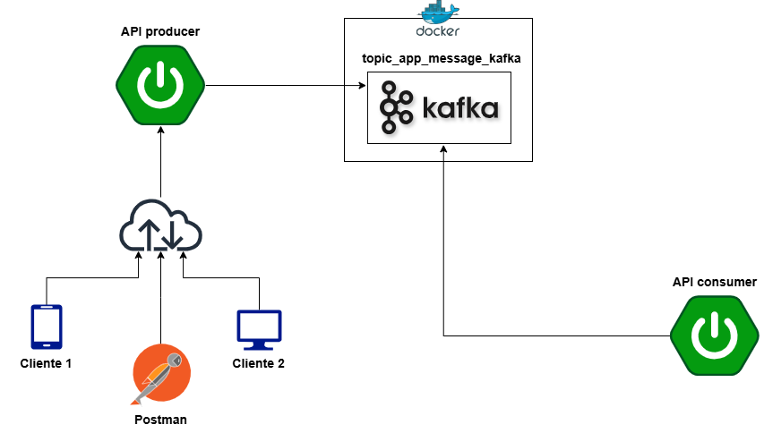

# spring-boot-kafka
A aplicação é um sistema de processamento de mensagens que gerencia eventos representados por um DTO (MensagemDTO). Quando uma mensagem é recebida, o sistema publica um evento no Kafka para notificar outros serviços. Esses serviços consomem as mensagens de forma assíncrona, processam suas tarefas e, se necessário, publicam novos eventos no Kafka.

### Explorando

## Rodando servidor Kafka.

cd \spring-boot-kafka\docker
docker-compose -f kafka-docker-compose.yml up -d

Obs: Docker Desktop rodando.

## Rodando app produtor.

cd \spring-boot-kafka\producer
mvnw spring-boot:run

<b>Usar o Postman: </b>
http://localhost:8080/mensagem

Body (JSON)
{
    "origem": "onde",
    "dataHora": "2025-04-13 08:40:25",
    "mensagem": "Hoje é domingo de Ramos."
}

## Rodando app consumer.

cd \spring-boot-kafka\consumer
mvnw spring-boot:run

### Requisitos

	
	
	
	
	
	

### Distribuição

